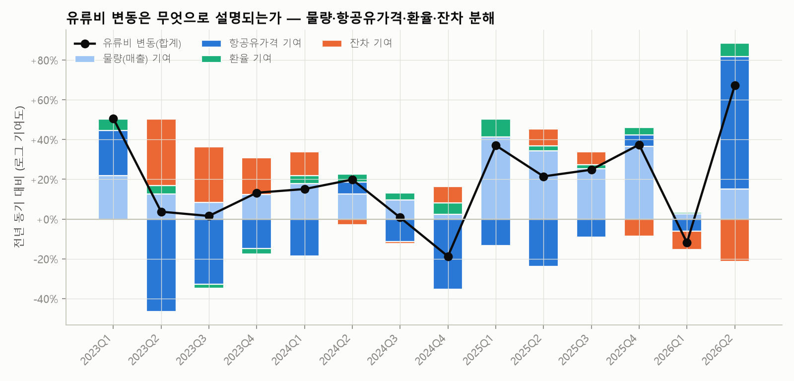
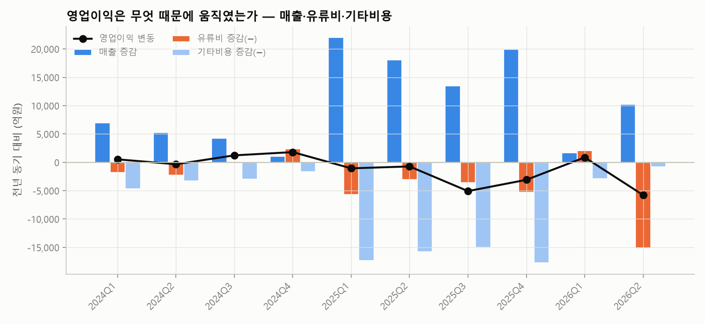
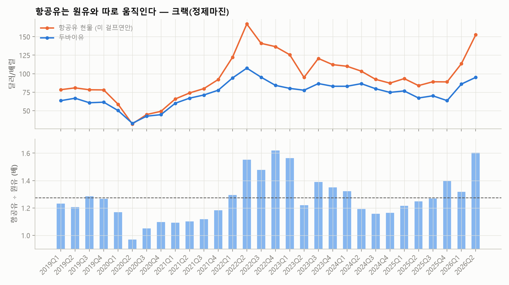
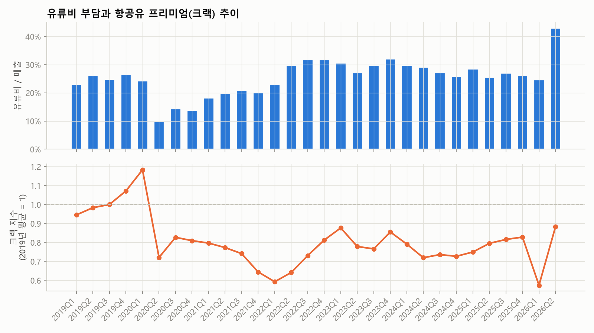
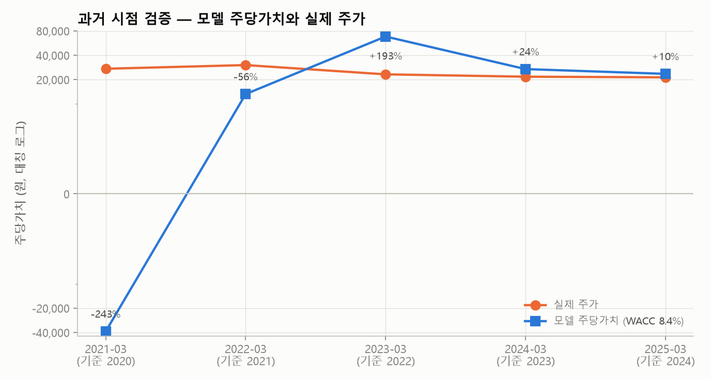
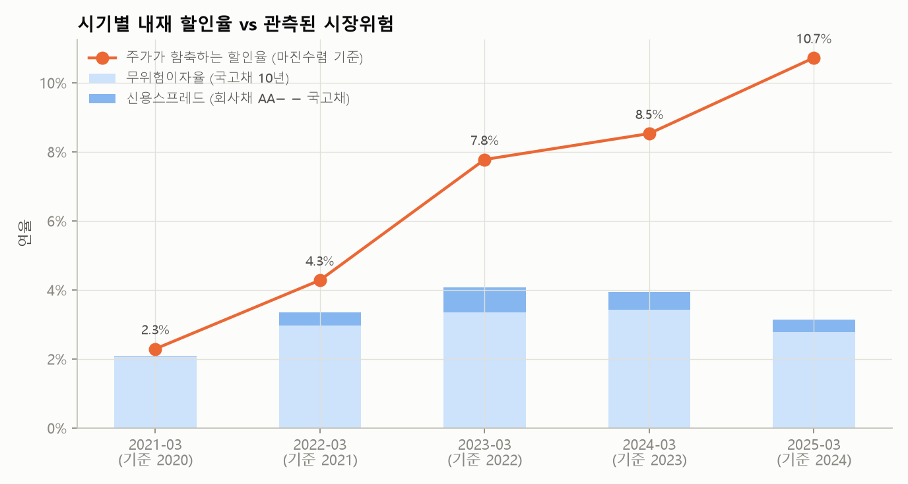

# 유가·환율은 항공사 현금흐름을 어떻게 움직이는가 — 대한항공 분기 실증 분석

**공개 API(DART·한국은행 ECOS·공공데이터포털)만으로 30개 분기 데이터셋을 만들어,
유가·환율이 항공사의 원가와 영업이익에 미친 영향을 분해하고 민감도를 추정한 프로젝트입니다.
후반부에서는 이 민감도를 기업가치로 환산해 보고, 그 과정에서 확인된 한계를 함께 기록했습니다.**

대상: 대한항공(003490) 연결 기준 · 2019Q1~2026Q2

---

## 1. 요약

| 구분 | 내용 |
|---|---|
| 핵심 질문 | 유가와 환율이 항공사의 **현금흐름**에 얼마나, 어떤 경로로 영향을 미쳤는가 |
| 데이터 | 분기 유류비(정기보고서 주석 30개 분기), 분기 손익(DART API), 항공유 현물(FRED), 두바이유·원/달러(ECOS) |
| 검증 | 분기 유류비 합계가 **7개 연도 모두 연간 공시액과 일치**. 환산 소비량은 회사 공시 소모량과 정합 |
| 결과 ① | 2026Q2 유류비 **+96%** 중 항공유 가격 기여가 **+67%p** — 물량·환율은 각 +15%p, +7%p |
| 결과 ② | **항공유는 원유와 따로 움직인다.** 크랙 배수 1.0배(2020Q2) → **1.60배**(2026Q2). 원유 선물로는 못 막는 위험 |
| 결과 ③ | 항등식 민감도(2025년 연결): 항공유 1달러/배럴 = 연 **754억원**, 영업이익의 7% |
| 결과 ④ | **유류할증료 전가율을 실적에서 추정: 0.89~1.19** (2026Q2 단일 분기 0.66). 거의 전액 전가에 가까움 |
| 적용과 한계 | 같은 구조로 DCF를 만들었으나 **할인율을 데이터로 추정할 수 없었고**(베타 R² 18%), 과거 5개 시점 검증에서 괴리가 컸음 |

분석 문서: [`output/cashflow_analysis.md`](output/cashflow_analysis.md) · 데이터셋: [`output/quarterly.csv`](output/quarterly.csv) · 시나리오 대시보드: [`dashboard/index.html`](dashboard/index.html) — 기준연도(2019~2025)를 고르고 유가·환율·물량을 바꿔 영업이익을 비교

## 2. 데이터셋 만들기

유류비는 재무제표 API에 없고 **'비용의 성격별 분류' 주석**에만 있습니다. 보고서 양식이 시기마다 달라
세 가지 형식을 구분해 파싱했습니다([`src/quarterly.py`](src/quarterly.py)).

| 항목 | 출처 | 비고 |
|---|---|---|
| 분기 유류비 | 정기보고서 31건 원문(DART `document.xml`) | 연결 표의 당분기 3개월 값. 4분기 = 연간 − 1~3분기 |
| 분기 매출·영업이익 | DART `fnlttSinglAcntAll` | 사업보고서는 연간값이므로 4분기는 차감해 계산 |
| 두바이유·원/달러 | ECOS 902Y003 / 731Y001 | 분기 평균 |
| 항공유 현물가격 | FRED `DJFUELUSGULF` (원자료 미국 EIA) | 미 걸프연안 FOB. 4주 시차를 준 분기 평균이 잔차를 가장 줄임 (17.9% → 14.5%) |

**검증:** 분기 유류비 합계 vs 연간 공시액 → 2019~2025년 7개 연도 모두 차이 0.0억원.

## 3. 유류비는 무엇으로 움직이는가

유류비를 네 요인의 곱으로 보고 전년 동기 대비 로그 기여도로 나눴습니다. 항등식이라 기여도가 그대로 더해집니다.

```
유류비 = 물량 × 항공유가격 × 환율 × 잔차
        (잔차 = 연료 효율, 매출-물량 괴리, 매입 시차, 헤지 손익 귀속)
```



| 분기 | 유류비 변동 | 물량 | 항공유가격 | 환율 | 잔차 | 크랙 배수 |
|---|---|---|---|---|---|---|
| 2024Q4 | −17.1% | +2.4% | −35.2% | +5.6% | +8.4% | 1.17배 |
| 2025Q2 | +23.9% | +34.4% | −23.8% | +2.4% | +8.5% | 1.25배 |
| 2025Q4 | +45.4% | +36.7% | +5.7% | +3.8% | −8.7% | 1.40배 |
| 2026Q1 | −11.2% | +2.5% | −6.0% | +0.9% | −9.2% | 1.32배 |
| **2026Q2** | **+95.7%** | +15.2% | **+66.6%** | +6.7% | −21.4% | **1.60배** |

## 4. 민감도 — 항등식으로 직접 계산

유류비는 항등식이므로 탄력성을 회귀로 추정할 필요가 없습니다. 2025년 연결 실적 기준입니다.

| 변화 | 연간 유류비 영향 | 2025년 영업이익(11,136억원) 대비 |
|---|---|---|
| 항공유 1달러/배럴 상승 | **754억원** | 7% |
| 항공유 10% 상승 | **6,742억원** | 61% |
| 환율 10원 상승 | **474억원** | 4% |

환산 소비량은 2025년 연결 기준 **53.0백만 배럴**입니다. 회사는 사업보고서에 "연간 예상 소모량 약 3,050만 배럴,
유가 1달러 변동 시 약 3,050만 달러"라고 공시하는데 이는 대한항공 단독 기준입니다.
**공시 민감도를 외부 데이터로 재현하고 아시아나 포함 연결 기준(1.7배)으로 확장한 것이 위 표입니다.**

환율은 유류비만 보면 10원당 474억원이지만, 회사 공시 순노출은 "연간 달러 부족량 16억 달러,
환율 10원 변동 시 약 160억원"입니다. 달러 매출이 상당 부분을 상쇄하기 때문입니다.

> **회귀 계수를 쓰지 않은 이유**: 같은 데이터로 회귀하면 항공유 0.62, 환율 −0.31, 매출 1.26이 나옵니다(R² 0.97).
> 항등식상 계수는 모두 1이어야 하므로, 1에서 벗어난 만큼은 잔차 요인이 각 변수와 함께 움직인 정도일 뿐입니다.
> 표본을 바꾸면 환율 계수가 음수까지 내려갈 만큼 불안정해 구조적 탄력성으로 제시하지 않았습니다.

## 5. 유류할증료는 얼마나 전가되나

유가가 오르면 항공사는 유류할증료로 일부를 운임에 넘깁니다. 이 전가율을 실적에서 추정했습니다.

```
Δ매출 = a·Δ여객 + b·Δ화물 + p·(유류비 가격효과)
        유류비 가격효과 = 환산 소비량 × 단가 변동   ← 물량 효과를 뺀 순수 가격 요인
```

물량은 인천공항 노선별 운송실적(연결 대상 항공사)을 썼고, 전년 동기 대비 변화로 회귀했습니다.
연결 범위와 화물 데이터 정의가 모두 일치하는 **2019~2024년**으로 한정했습니다.

| 표본 | 관측치 | 전가율 p | 95% 구간 | R² |
|---|---|---|---|---|
| 2019~2024 전체 | 20 | **1.19** | 0.79~1.58 | 0.92 |
| 2020년 제외 | 16 | 1.13 | 0.68~1.58 | 0.77 |
| 2022년 이후 | 12 | **0.89** | 0.40~1.38 | 0.79 |
| 2026Q2 단일 분기(연결 범위 동일) | 1 | 0.66 | — | — |

**거의 전액 전가에 가깝습니다.** 다만 2021~2022년은 유가 급등과 코로나 이후 운임 급등이 겹쳐 추정치가
위로 치우쳤을 수 있고, 급등 국면인 2026년 2분기에는 0.66으로 낮습니다. 전가에는 시차가 있고
(할증료는 발권 시점 기준, 월 단위로 조정), 급등기에는 전가가 늦어집니다.
모델과 대시보드는 중앙값 수준인 **0.9**를 기본값으로 씁니다.

## 6. 영업이익은 무엇 때문에 움직였나



| 분기 | 영업이익 변동 | 매출 증감 | 유류비 증감(−) | 기타비용 증감(−) |
|---|---|---|---|---|
| 2024Q4 | +1,798억 | +1,084억 | +2,396억 | −1,681억 |
| 2025Q3 | −5,081억 | +13,516억 | −3,569억 | −15,028억 |
| 2026Q1 | +863억 | +1,662억 | +2,063억 | −2,862억 |
| 2026Q2 | **−5,772억** | +10,193억 | **−15,162억** | −804억 |

2026년 2분기 영업적자(−2,071억)는 유류비가 직접 원인입니다. 매출이 1조원 늘었지만 유류비가 1.5조원 늘었습니다.
2025년 분기들은 아시아나 연결로 매출과 기타비용이 동시에 급증해, 전년 동기 비교가 연결 범위 변화에 오염돼 있습니다.

## 7. 항공유는 원유와 따로 움직인다



항공사 원가를 좌우하는 것은 원유가 아니라 **항공유** 가격입니다. 둘의 배수(크랙)는 2020년 2분기 1.0배에서
2026년 2분기 1.60배까지 벌어졌습니다. 2023년 1분기에는 원유가 전년 대비 내렸는데도 크랙이 1.57배로 확대돼
유류비 부담이 유지됐습니다.

**원유 선물로 헤지해도 이 부분은 남습니다(베이시스 리스크).** 회사는 연간 소모량의 최대 50%를
Zero Cost Collar 등으로 헤지한다고 공시하는데, 기초자산이 원유라면 크랙 확대는 막지 못합니다.



가격 대용치가 타당한지는 수준으로 검증했습니다. 항공유 기준 환산 소비량은 분기 8~13백만 배럴로 안정적이고,
공시된 단독 소모량(분기 약 7.6백만 배럴)에 자회사·아시아나를 더한 규모와 맞습니다.
원유 기준으로 환산하면 분기 11~17백만 배럴로 과대 추정됩니다.

## 8. 적용 — 이 민감도를 기업가치로 환산하면

같은 구조를 DCF에 넣어 유가·환율이 가치에 미치는 영향을 계산했습니다(`python run.py`).

- 유류비를 `소비량 × 유가 × 환율`로 모델링하고, 5장에서 추정한 전가율 0.9와 달러 순부채의 환율 재평가를 반영
- 기준연도 2024년(아시아나 pro forma 합산, 공시 pro forma 매출 261,893억과 일치 검증)
- 할인율은 회사가 공시한 8.4% 채택 — 대한항공 2024 사업보고서 주석 46, 아시아나 무형자산 평가에 사용된 WACC

결과는 주당 23,511원(평가기준일 2025-03-31 주가 21,300원 대비 +10%)이고,
시장가격 역산으로는 할인율 8.59% / 비유류비율 51.1% / 유가 83달러를 함축했습니다.
자세한 내용은 [`output/summary.md`](output/summary.md), 모델은 [`output/valuation_model.xlsx`](output/valuation_model.xlsx)에 있습니다.

## 9. 한계 — 가치평가는 왜 확정적으로 말할 수 없는가

**(1) 할인율을 데이터로 추정할 수 없었습니다.**

| 방법 | 베타 | WACC |
|---|---|---|
| KOSPI 대비 회귀 | 0.517 | 4.33% |
| KOSPI 반도체 제외 대비 회귀 | 0.620 (R² 18%) | 4.47% |
| 회사 공시값(채택) | — | 8.40% |

평가기준일 현재 반도체 3종목이 KOSPI 시가총액의 25.5%를 차지해 개별 종목 베타가 왜곡됩니다. 반도체를 제외해도 R²는 18%였습니다.
목표 자본구조를 바꿔도 WACC는 4.33%→4.38%로 거의 변하지 않습니다(베타 재레버리지로 상쇄, MM 명제).

**(2) 과거 시점 검증에서 괴리가 컸습니다.** ([`backtest.py`](backtest.py))



| 평가일 | 기준연도 | 모델 | 실제 주가 | 괴리 |
|---|---|---|---|---|
| 2021-03-31 | 2020 (코로나) | −38,802원 | 27,200원 | −243% |
| 2022-03-31 | 2021 | 13,241원 | 30,200원 | −56% |
| 2023-03-31 | 2022 (화물 호황) | 68,066원 | 23,200원 | +193% |
| 2024-03-31 | 2023 | 26,940원 | 21,700원 | +24% |
| 2025-03-31 | 2024 | 23,511원 | 21,300원 | +10% |

DCF는 기준연도 실적을 영구화합니다. 시장은 반대로 이익이 바닥일 때 높은 배수(2021-03 EV/EBITDA 11.6배),
정점일 때 낮은 배수(2023-03 4.2배)를 적용했습니다. 마진·매출을 기계적으로 정상화해도 평균 절대 괴리는 105%→98%로 거의 줄지 않았습니다.

**(3) 괴리는 시장위험으로 설명되지 않습니다.**



각 시점 주가를 설명하는 할인율을 역산하면 2.3% → 4.3% → 7.8% → 8.5% → 10.7%로 움직이는데,
관측된 무위험이자율+신용스프레드는 2.1~3.2%로 거의 고정입니다. 역산된 시장위험프리미엄은 0.2~36.2%로
현실적인 범위를 벗어납니다. 즉 **할인율이 아니라 현금흐름 추정(무엇을 정상으로 보는가)이 괴리의 원인**입니다.

다만 실적이 정상 범위였던 2023·2024년 기준 시점의 내재 할인율은 7.8%, 8.5%로 채택한 8.4%와 거의 같았습니다.

**(4) 분석 자체의 한계**

- 물량 대용치로 매출을 사용했습니다. 매출에는 유류할증료가 포함돼 가격 요인과 일부 겹칩니다. 공시 수송실적(ASK·RPK)은 반기·연간 단위입니다.
- 항공유 가격은 미국 걸프연안 현물입니다. 실제 매입 기준인 싱가포르 MOPS 는 유료 데이터(플라츠)입니다. 국내 유류할증료 단계(MOPS 기반)로 역산한 수준과 방향은 일치하나 절대 수준에는 차이가 있습니다.
- 2025년 이후 전년 동기 비교는 아시아나 연결로 범위가 다릅니다.
- 4분기 유류비는 연간에서 차감해 만든 값이고, 반기보고서의 3개월 칸을 2분기로 봤습니다.
- 잔차 요인에는 연료 효율 외에 헤지 손익 귀속, 재고 효과, 매출-물량 괴리가 섞여 있어 하나로 해석하면 안 됩니다.
- 유류할증료 인상에 따른 수요 감소 경로는 검토했으나 근거가 부족해 제외했습니다(10장).

## 10. 검토했으나 반영하지 않은 것: 유류할증료 인상에 따른 수요 감소

| 항목 | 내용 |
|---|---|
| 검토 | 인천공항 국제선 출발 여객을 목적지 거리별로 나눠, 할증료 급등기(2026년 5~6월 발권분 33·27단계)와 평상시(2019 vs 2018, 2025 vs 2024)의 전년 대비 증가율 격차 비교 |
| 데이터 | 공공데이터포털 `인천국제공항공사_항공사별 노선별 운송실적`, 공항 좌표(OurAirports), 할증료 단계(항공사 공지·보도) |
| 결과 | 중거리(동남아)에서 평소 범위를 벗어난 추가 감소(6~9%p)가 있었으나 두 달뿐. 장거리는 같은 시기 전쟁 영향과 분리 불가. 평상시에는 할증료 변동폭이 작아 탄력성 추정 불가 |
| 판단 | 근거 부족으로 제외. 영향 방향은 "유가 상승 시나리오의 가치 하락이 과소평가될 수 있음" |

## 11. NH선물 API 연동 계획

유가·환율 가정은 현재 "최근 12개월 평균 고정"입니다. [`src/market.py`](src/market.py)의 `NHFuturesCurve`가 연동 자리입니다.

| 단계 | 내용 | 이 분석과의 연결 |
|---|---|---|
| 1 | 원유 선물 월물 → 연도별 선도가격 | 4장의 항등식 민감도(배럴당 1달러 = 754억원)를 선도가격에 적용 |
| 2 | 미국달러선물 → 선도환율 | 환율 민감도(10원 = 474억원) 적용 |
| 3 | 헤지 전략을 계약 수·증거금으로 환산 | 공시 헤지 정책(소모량의 최대 50%)과 대조 |
| 4 | 옵션 내재변동성 | 몬테카를로 변동성 교체 |

원유 선물로는 크랙 변동(6장)을 헤지할 수 없다는 점도 함께 다룰 수 있습니다.

## 12. 실행 방법

```bash
pip install -r requirements.txt
cp .env.example .env            # DART, ECOS, 공공데이터포털 키 입력

python build_quarterly.py       # 분기 데이터셋 → output/quarterly.csv
python analyze_cashflow.py      # 요인 분해·민감도·브리지 → output/cashflow_analysis.md, 차트
python run.py                   # DCF 적용 → output/summary.md, valuation_model.xlsx
python backtest.py              # 과거 시점 검증 → output/backtest.csv
python -m unittest discover -s tests -t .
```

Windows에 Excel이 있으면 `run.py` 마지막에 엑셀 모델을 재계산해 파이썬 결과와 일치하는지 자동 확인합니다.

## 13. 폴더 구조

```
├─ build_quarterly.py   분기 데이터셋 수집 (주석 파싱 + API)
├─ analyze_cashflow.py  요인 분해·민감도·영업이익 브리지 (본론)
├─ run.py               DCF 적용
├─ backtest.py          과거 5개 시점 검증, 내재 할인율 역산
├─ config.toml          모든 가정 (근거 주석 포함)
├─ src/
│  ├─ sources/          DART · ECOS · 공공데이터포털 클라이언트 (재시도·키 마스킹·캐시)
│  ├─ quarterly.py      정기보고서 주석에서 분기 유류비 추출 (3개 양식 대응)
│  ├─ jetfuel.py       항공유 현물가격 (reference/ CSV, 시차 옵션)
│  ├─ decomposition.py  요인 분해·민감도 회귀·영업이익 브리지
│  ├─ financials.py     DART 계정 매핑, pro forma 합산, 매핑 로그
│  ├─ market_index.py   반도체 제외 KOSPI (베타 추정용)
│  ├─ market.py         무위험이자율·베타·변동성, 가격 커브 (NH선물 연동 자리)
│  ├─ model.py          WACC, 유가·환율 연동 추정, DCF, 달러 순부채 환율 재평가
│  ├─ implied.py        시장가격 역산
│  ├─ risk.py           민감도·몬테카를로·헤지 분석
│  └─ report.py         차트·엑셀 모델·요약
├─ dashboard/           시나리오 대시보드 (기준연도 2019~2025 선택 + 유가·환율·물량 시나리오)
├─ reference/           외부 참조 데이터 (항공유 현물가격 CSV + 출처·갱신 방법)
├─ tests/               계정 매핑·DCF·시뮬레이션·환율 재평가 테스트 11개
└─ output/              quarterly.csv, cashflow_analysis.md, summary.md,
                        valuation_model.xlsx, backtest.csv, charts/
```
