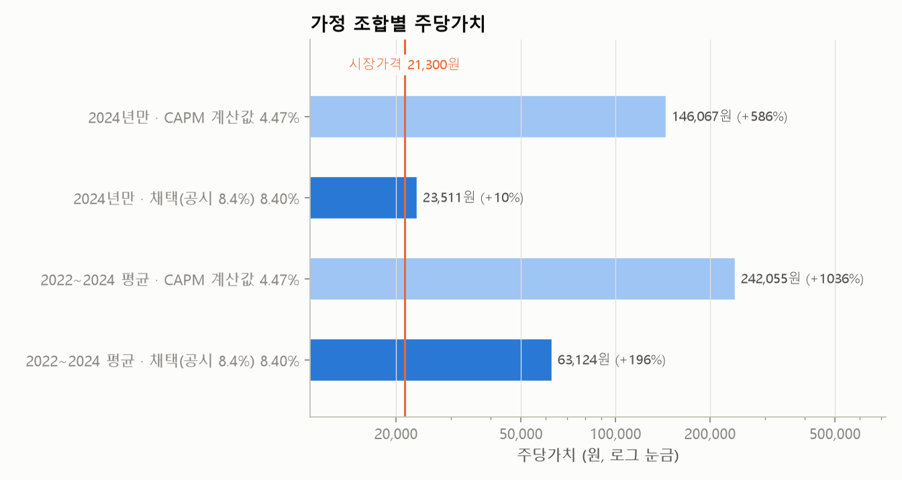
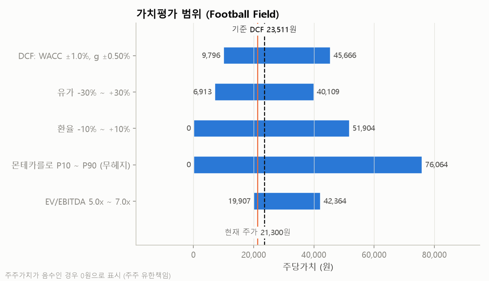
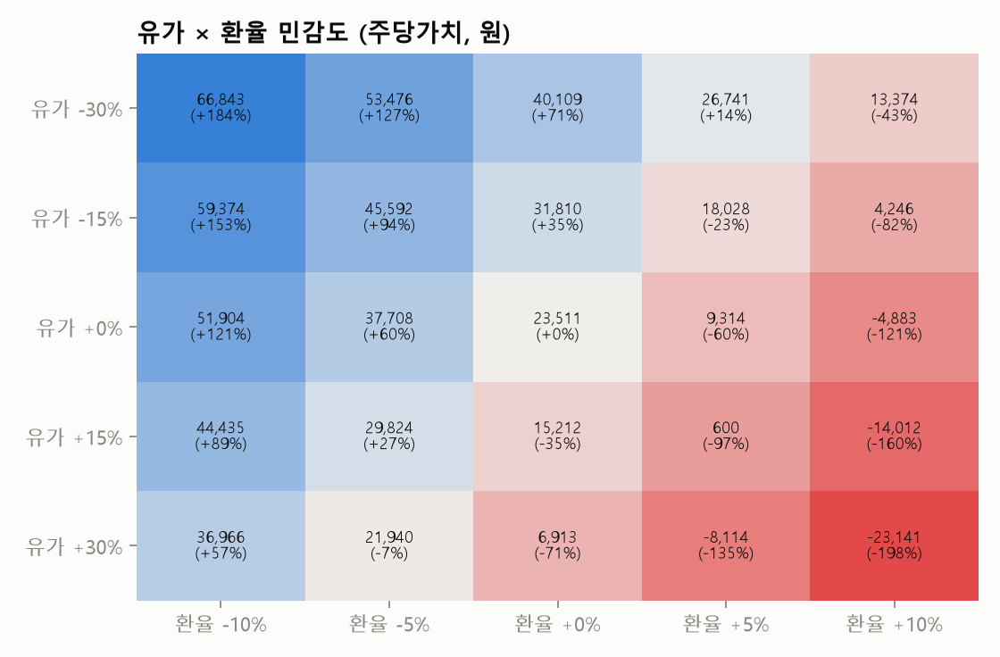
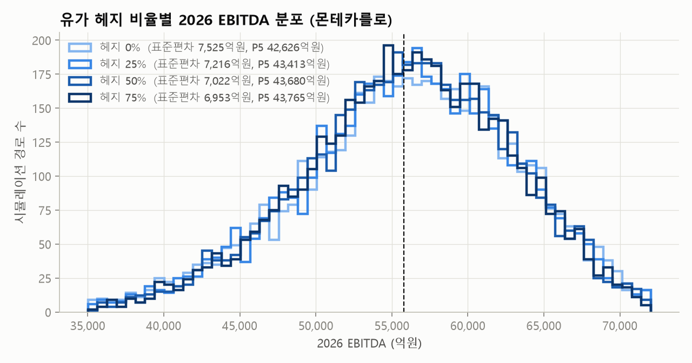
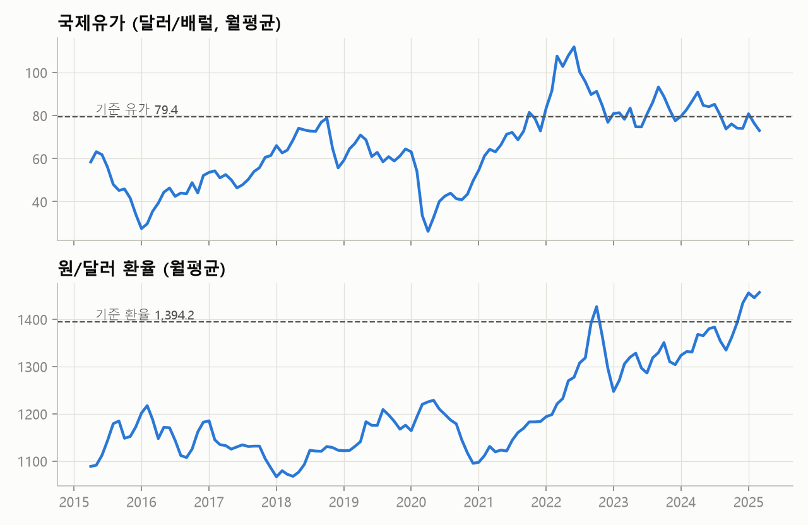

# 대한항공 밸류에이션 요약

- 평가기준일: 2025-03-31 / 기준 재무연도: 2024
- 유가·환율 커브: 최근 평균가격 고정(선물 커브 미반영)
- 엑셀 수식 검증: 통과 — 엑셀 수식 결과가 파이썬 계산과 일치

## 결과

| 항목 | 값 |
|---|---|
| 기업가치 (EV) | 263,455 억원 |
| 순차입금 (리스부채 포함) | 172,103 억원 |
| 주주가치 | 86,571 억원 |
| **주당가치** | **23,511 원** |
| 현재 주가 | 21,300 원 |
| 괴리율 | +10.4% |
| 잔존가치 비중 | 83.5% |

## 시장가격 역산 — 지금 주가를 설명하려면 무엇을 가정해야 하는가

| 항목 | 시장가격이 함축하는 값 | 모델 가정 |
|---|---|---|
| 할인율(WACC) | 8.59% | 8.40% |
| 영구성장률 | 1.77% | 2.00% |
| 비유류 현금비용/매출 | 51.1% | 50.9% |
| 유가(달러/배럴) | 83 | 79 |
| EV/EBITDA(배) | 4.8 | 4.9 |

다른 가정을 그대로 두고 한 항목만 움직였을 때, 시가총액과 같아지는 값입니다.

## 가정 조합별 주당가치

| 비율 기간 | 비유류비/매출 | 할인율 | EV(억원) | EV/EBITDA | 주당가치(원) |
|---|---|---|---|---|---|
| 2024년만 | 50.9% | CAPM 계산값 4.47% | 714,731 | 13.4배 | 146,067 |
| 2024년만 | 50.9% | 채택(공시 8.4%) 8.40% | 263,455 | 4.9배 | 23,511 |
| 2022~2024 평균 | 46.1% | CAPM 계산값 4.47% | 1,068,181 | 20.0배 | 242,055 |
| 2022~2024 평균 | 46.1% | 채택(공시 8.4%) 8.40% | 409,320 | 7.7배 | 63,124 |

## 할인율

| 항목 | 값 |
|---|---|
| **채택 할인율** | **8.40%** (회사 공시값 채택) |
| CAPM 계산값 | 4.47% |
| 무위험이자율 (국고채 10년) | 2.77% |
| 베타 (원시 → Blume → 재레버리지) | 0.620 → 0.745 → 0.745 |
| 베타 추정 방법 | KOSPI 반도체 제외 대비 주간수익률 회귀 (104주, R² 18.0%) |
| 시장위험프리미엄 | 7.00% |
| 자기자본비용 | 7.99% |
| 세후 타인자본비용 | 3.05% |
| 자기자본 비중 | 28.8% |
| **WACC** | **8.40%** |

## 추정 손익 (기준 커브)

| 억원 | 2025 | 2026 | 2027 | 2028 | 2029 |
|---|---|---|---|---|---|
| 매출 | 270,965 | 280,449 | 288,862 | 297,528 | 304,966 |
| 유류비 | 78,567 | 81,317 | 83,757 | 86,269 | 88,426 |
| EBITDA | 53,898 | 55,784 | 57,458 | 59,182 | 60,661 |
| FCFF | 10,365 | 10,729 | 11,033 | 11,364 | 11,630 |

## 가치평가 범위 (주당가치, 원)

|  | 하단 | 상단 |
|---|---|---|
| DCF: WACC ±1.0%, g ±0.50% | 9,796 | 45,666 |
| 유가 -30% ~ +30% | 6,913 | 40,109 |
| 환율 -10% ~ +10% | 0 | 51,904 |
| 몬테카를로 P10 ~ P90 (무헤지) | 0 | 76,064 |
| EV/EBITDA 5.0x ~ 7.0x | 19,907 | 42,364 |

## 유가 × 환율 민감도 (주당가치, 원)

|  | 환율 -10% | 환율 -5% | 환율 +0% | 환율 +5% | 환율 +10% |
|---|---|---|---|---|---|
| 유가 -30% | 66,843 | 53,476 | 40,109 | 26,741 | 13,374 |
| 유가 -15% | 59,374 | 45,592 | 31,810 | 18,028 | 4,246 |
| 유가 +0% | 51,904 | 37,708 | 23,511 | 9,314 | -4,883 |
| 유가 +15% | 44,435 | 29,824 | 15,212 | 600 | -14,012 |
| 유가 +30% | 36,966 | 21,940 | 6,913 | -8,114 | -23,141 |

## 유가 헤지 비율별 분포

| 헤지비율 | 2026 EBITDA 평균(억원) | 2026 EBITDA 표준편차(억원) | 2026 EBITDA 적자 확률 | 주주가치 음수 확률 | 주당가치 평균(원) | 주당가치 P5(원) | 주당가치 P50(원) | 주당가치 P95(원) |
|---|---|---|---|---|---|---|---|---|
| 0% | 55,946 | 7,525 | 0.0% | 23.9% | 22,619 | -68,985 | 32,120 | 86,880 |
| 25% | 55,945 | 7,216 | 0.0% | 24.0% | 22,621 | -68,315 | 32,067 | 86,681 |
| 50% | 55,944 | 7,022 | 0.0% | 24.0% | 22,621 | -67,434 | 31,934 | 86,330 |
| 75% | 55,943 | 6,953 | 0.0% | 24.0% | 22,618 | -66,945 | 31,780 | 85,982 |

헤지 비용이 없고 선물가격이 기대 현물가격과 같다고 가정하면, 헤지로 **평균 가치는 거의 변하지 않고 분포의 폭(하방 위험)만 줄어듭니다.**
헤지가 기업가치를 높이는 경로는 재무적 곤경 비용, 차입 여력, 세금 비선형성 같은 시장 마찰에서 나옵니다.

## 차트

